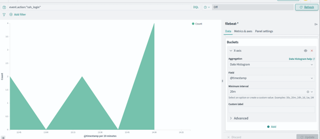
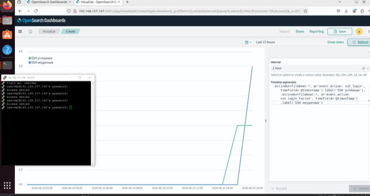
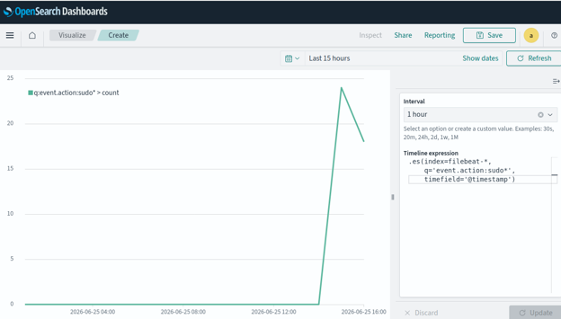
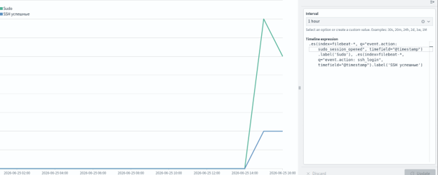

## Log-Monitoring-Stack-with-OpenSearch-Logstash-and-Beats

Это тестовый проект, демонстрирующий:
- Развертывание OpenSearch + Dashboards + Logstash через Docker Compose.
- Сбор логов с помощью Filebeat, Winlogbeat и Syslog.
- Парсинг в ECS (SSH, SUDO, Windows события).
- Настройка алертов (Alerting + Security Analytics).
- Визуализация в OpenSearch Dashboards.

Краткая схема:
* Windows (Winlogbeat) -> Linux VM1 (Logstash (port 5044)) -> Linux VM1 (OpenSearch (port 9200)) <- Linux VM1 (OpenSearch Dashboards (5601))
* Linux VM2 (Filebeat) -> Linux VM1 (Logstash (port 5044))
* Linux VM2 (Syslog) -> Linux VM1 (Logstash (port 5514))

Требования
- Docker и Docker Compose (установлены обоих ВМ с Linux).
- Linux ВМ2 (Ubuntu 22.04+) для отправки syslog и Filebeat.
- Хостовая Windows (для Winlogbeat).
- Открытые порты на первой ВМ: 9200, 5601, 5044, 5514 (TCP/UDP).

## Визуализации и дашборды

Гистограмма успешных SSH-входов по времени:

Сравнение успешных и неудачных попыток SSH:

Гистограмма событий sudo:

Комбинированный график SSH + sudo:

